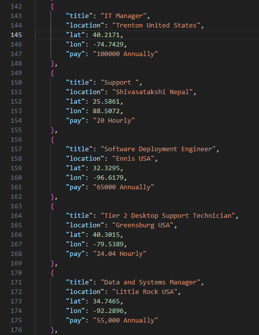

# This-is-an-IT-Support-Group-Data-Project
This project aimed to take salary response data from the annual *This is an IT Support Group* open salary report on Facebook and display it in a creative way using Tableau. The group is a private group on Facebook in which the *About* section says "For IT Professionals. We're here to support each other with both technical questions and IT career advice". The occasional meme is shared graciously.

## Initial Issues
Problems arose after initial download of the data when it was found that the input given in the survey was not normalized, validated, or sanitized before being submitted by willing group members. In addition, not all question responses were recorded in each JSON object, which is unfortunate for further data analysis. I made a copy of the exact form in case it gets taken down [here](https://forms.gle/rUWZVSgBwfQni6xNA). After looking at the form, many of the responses are short answer, which makes data analysis and segmentation a bit more challenging. 

## Before
The following image shows what each json object looked like before modification. 

## After
The following image shows what each json object looks like after modification with the supplied python file. Here you can see the new keys city, state, job-tier, and pay type. *Job tier* was devised from specifiers in the job title string such as "IT Analyst 3" or "Tier 2 Support" and *pay type* was determined from either "annually" or "hourly" being present in the pay value string. City and state were determined for each JSON object by reverse geocoding with Nominatum's API.  After being made aware of the charges for using the Google Maps API, this alternative was found to be worth the wait and price (free). These additional keys and values were added for further analysis and segmentation of the data.    

## What Have I Done?
I used AI (ChatGPT 4.0), some regex and other detection methods to figure out what additional values could be extracted, supplied, and where they would be placed. To finish things up, the Nominatum API was used to determine city and state from the lat/lon coordinates, which could have really been done from the start. 

To make the best of the data, the program generates a new JSON file with the additional key/value pairs as well as an SQLite database to perform interesting business queries against, before figuring out how to visualize everything on Tableau. 

