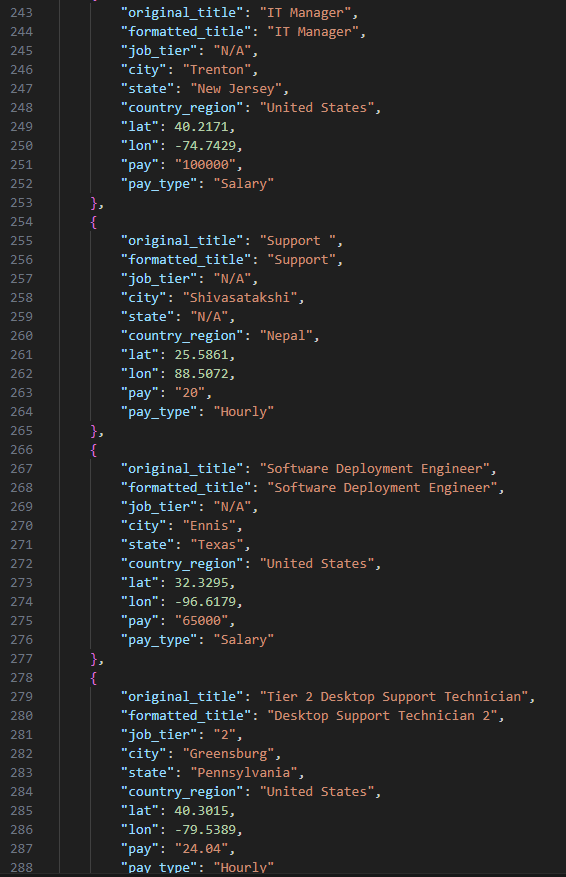

# This-is-an-IT-Support-Group-Data-Project
This project aimed to take salary response data from the annual *This is an IT Support Group* open salary report on Facebook and display it in a creative way using Tableau. The group is a private group on Facebook in which the *About* section says "For IT Professionals. We're here to support each other with both technical questions and IT career advice".

## Initial Issues
Problems arose after initial download of the data when it was found that the input given in the survey was not normalized, validated, or sanitized before being submitted by willing group members. In addition, not all question responses were recorded in each .json object, which is unfortunate for further data analysis. I made a copy of the exact form in case it gets taken down [here](https://forms.gle/rUWZVSgBwfQni6xNA) . As can be seen, many of the responses are short answer, which makes data analysis and segmentation a bit more challenging. 

## Before
The following image shows what each json object looked like before modification. 

## After
The following image shows what each json object looks like after modification with the supplied python file. Here you can see the keys city, state, original response, and pay type, which were added for clarity. 

## What did I do?
I used AI, some regex and other detection methods to figure out what values needed to be supplied, and where. To finish things up, the Google Maps API was used to determine city and state from the lat/lon coordinates, which could have really been done from the start. 

## How to run the program

